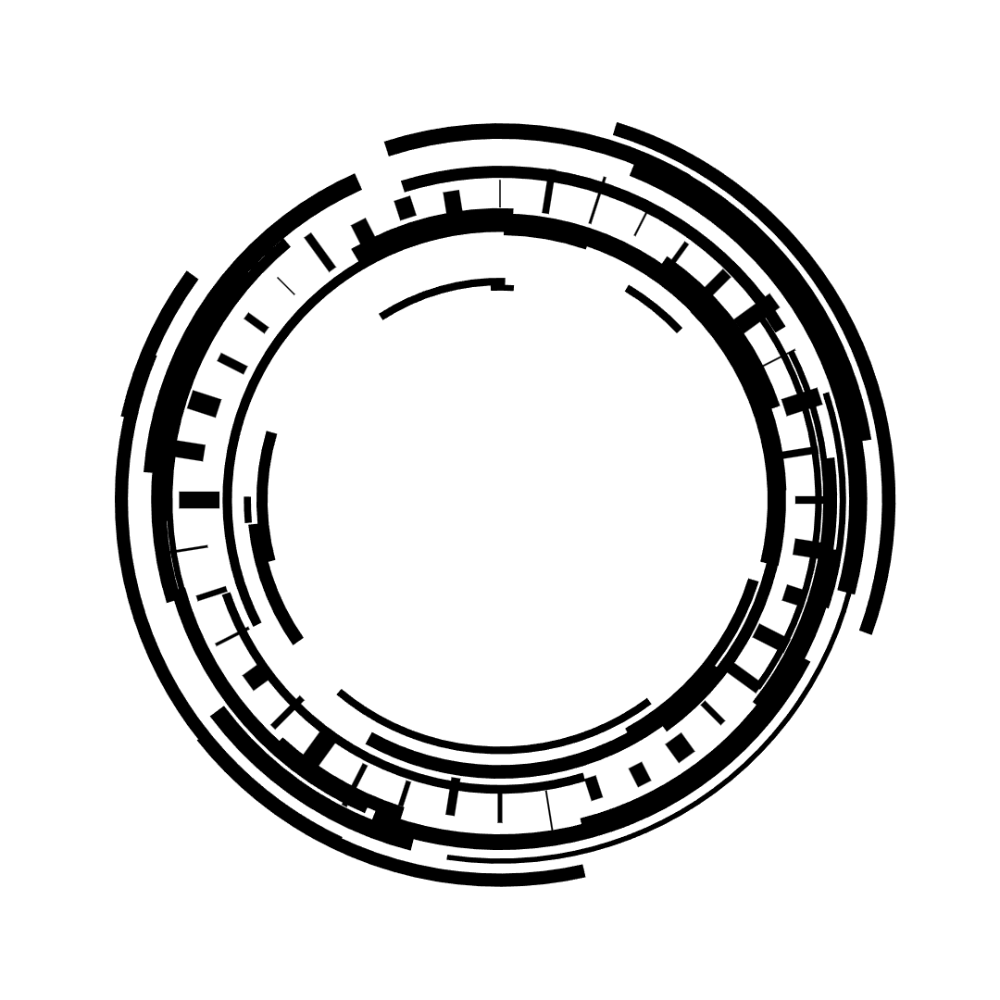

# Visualization using `canvas-sketch` lib

Visualization using the [`canvas-sketch`](https://github.com/mattdesl/canvas-sketch) library. `canvas-sketch` is a versatile framework for generative art and creative coding in JavaScript, providing tools for building visuals with HTML5 Canvas.

---

## Works

`sketch-01.js`


`sketch-02.js`



`sketch-03.js`


---


## Installation

1. **Clone this repository:**

   ```bash
   git clone https://github.com/Shatlyk1011/canvas-sketches
   ```

2. **Install canvas-sketch globally**
   ```
   npm i canvas-sketch-cli -g
   ```

3. **Install dependencies**
  ```
   cd canvas-sketches && npm i
  ```
